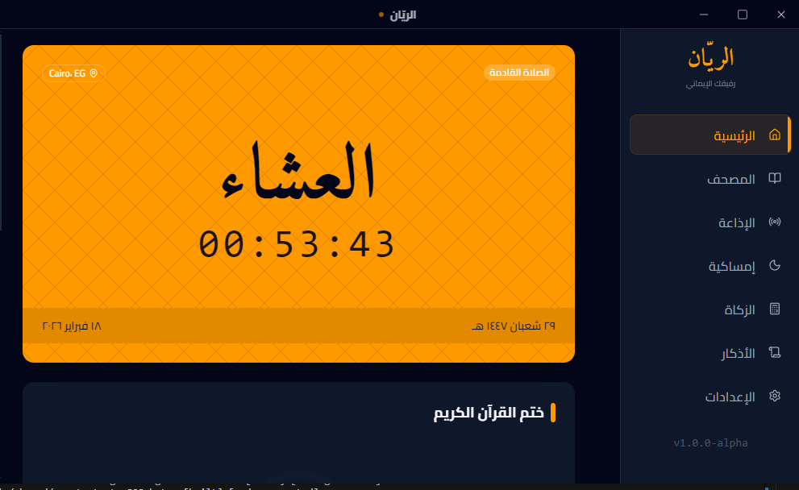
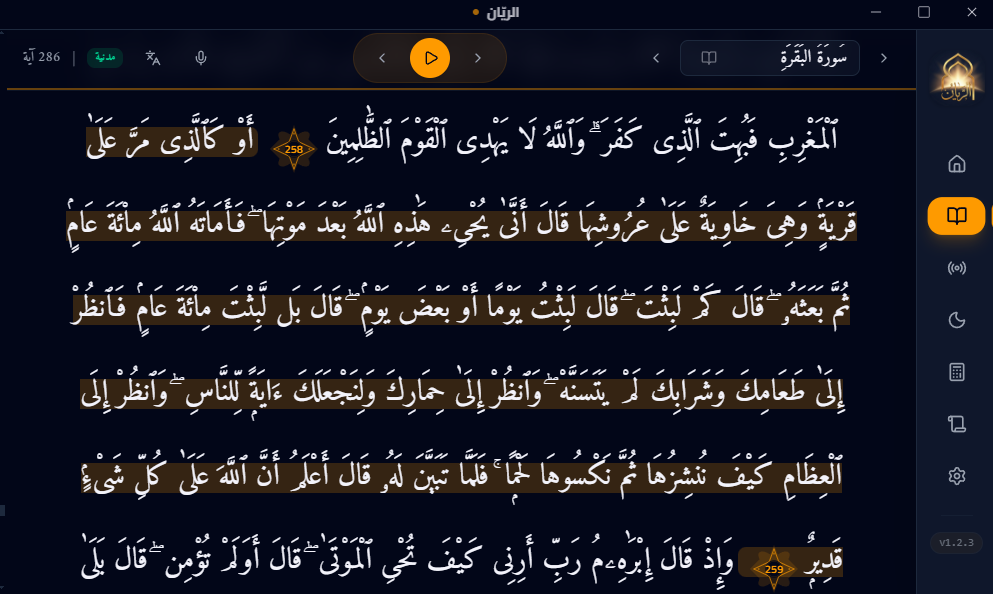
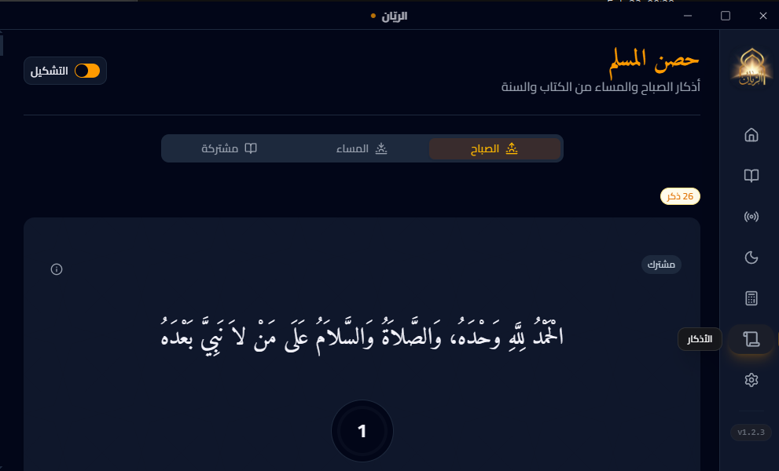
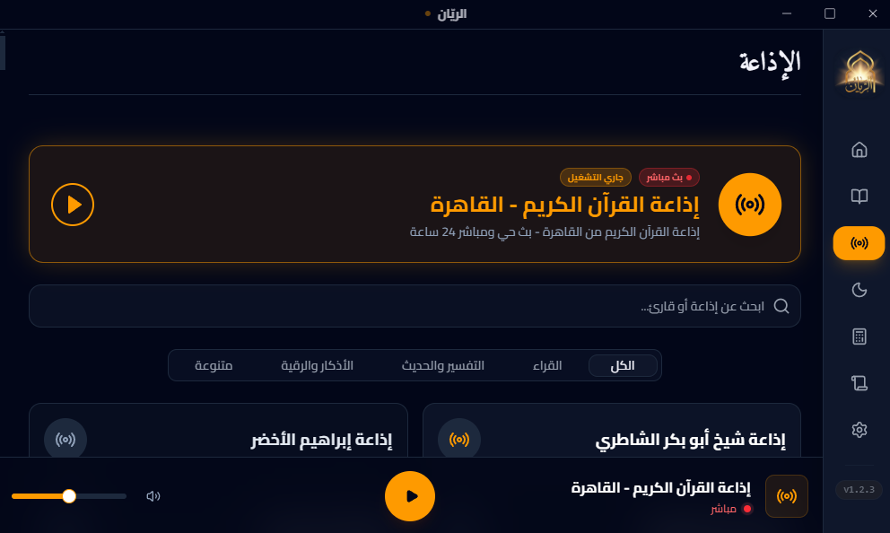
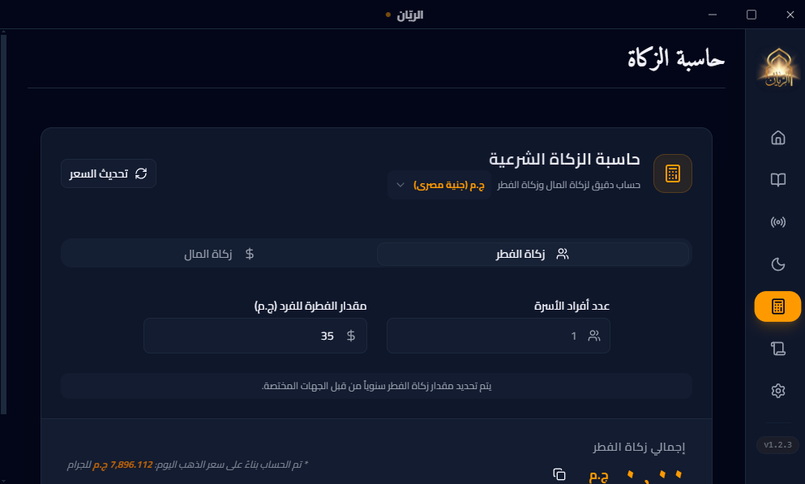
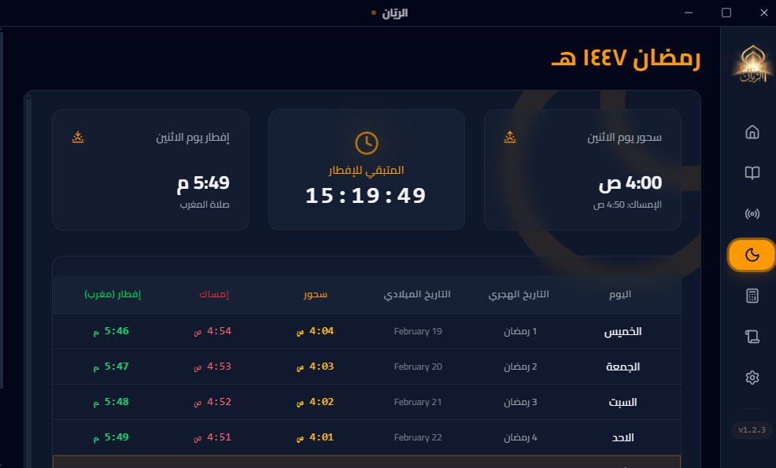
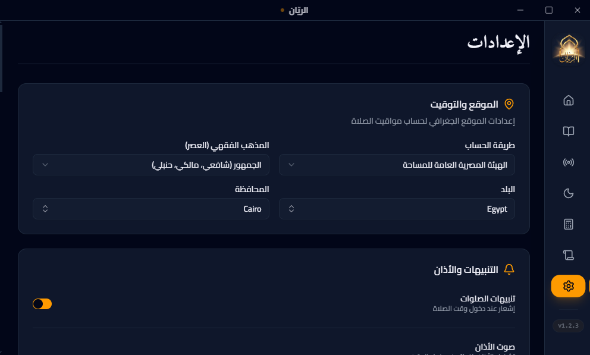

# 🌙 Al Rayyan | الريّان

<p align="center">
  
</p>

> **A Modern, Precise, and Beautiful Islamic Companion for your Desktop.**

[](https://github.com/mramadan18/al-rayyan-program/actions/workflows/release.yml)
[](https://github.com/mramadan18/al-rayyan-program/releases)
[](LICENSE)

---

## ✨ Overview | نبذة عن البرنامج

**Al Rayyan** is a comprehensive Islamic desktop application built to integrate seamlessly into your daily spiritual life. Designed with a focus on aesthetics and performance, it provides everything a Muslim needs—from precise prayer timings to interactive widgets—right on your Windows desktop.

**برنامج الريّان** هو رفيق إسلامي متكامل لسطح المكتب، صُمم ليجمع بين الجمال والدقة. يوفر لك كل ما تحتاجه في يومك من مواقيت الصلاة، الأذكار، والأدعية، مع واجهة مستخدم عصرية وأداء سلس.

---

## 📸 Screenshots | صور من البرنامج

### 🏠 Home Dashboard | الشاشة الرئيسية

_Displays the next prayer time, current date (Hijri & Gregorian), and quick access to daily essentials._
_تعرض وقت الصلاة القادمة، التاريخ (الهجري والميلادي)، مع وصول سريع للأدوات اليومية._

<p align="center">
  
</p>

### 📖 The Holy Quran | القرآن الكريم

_Read and listen to the Holy Quran with your favorite reciter and Tafsir options._
_اقرأ واستمع للقرآن الكريم بصوت مقرئك المفضل مع خيارات التفسير._

<p align="center">
  
</p>

### 📿 Azkar & Supplications | الأذكار والأدعية

_Keep your tongue moist with morning, evening, and daily Azkar._
_حافظ على رطوبة لسانك بذكر الله من خلال أذكار الصباح والمساء والأذكار اليومية._

<p align="center">
  
</p>

### 📻 Islamic Radio | إذاعة القرآن

_Listen to live broadcasts from Cairo Quran Radio and other Islamic stations._
_استمع للبث المباشر لإذاعة القرآن الكريم من القاهرة ومحطات إسلامية أخرى._

<p align="center">
  
</p>

### 💰 Zakat Calculator | حاسبة الزكاة

_Calculate Zakat Al-Maal and Zakat Al-Fitr precisely according to current gold prices._
_احسب زكاة المال وزكاة الفطر بدقة بناءً على أسعار الذهب الحالية._

<p align="center">
  
</p>

### 🌙 Ramadan Imsakia | إمساكية رمضان

_Track Suhoor and Iftar times throughout the holy month._
_تابع مواعيد الإمساك والإفطار طوال الشهر الفضيل._

<p align="center">
  
</p>

### ⚙️ Settings | الإعدادات

_Customize your experience: themes, prayer calculation methods, and notifications._
_خصص تجربتك: السمات، طرق حساب الصلاة، والإشعارات._

<p align="center">
  
</p>

---

## 🚀 Key Features | المميزات الرئيسية

### 🕋 Prayer Times & Adhan (مواقيت الصلاة والأذان)

- **Precise Calculation:** Accurate prayer times based on your location.
- **Adhan Notifications:** Beautiful Adhan audio notifications for every prayer.
- **Prayer Scheduler:** A background service that ensures you never miss a prayer.

### 🍱 Interactive Widgets (النوافذ العائمة)

- **Adhan Widget:** A minimalist overlay showing the time remaining for the next prayer.
- **Zikr Widget:** Rotating daily Azkar to keep your tongue moist with the remembrance of Allah.
- **Dua Widget:** Timed supplications that appear beautifully on your screen.

### 📖 Quran & Spiritual Tools (القرآن والأدوات الإيمانية)

- **Full Quran:** Read and listen to the Holy Quran with various reciters.
- **Zakat Calculator:** A professional tool to calculate Zakat Al-Maal and Zakat Al-Fitr.
- **Ramadan Imsakia:** Specialized view for the holy month's timings.

### 🔄 Auto-Updates (التحديثات التلقائية)

- **Always Current:** The app checks for updates automatically and notifies you of new features or fixes.

---

## 🛠 Built With | بني باستخدام

- **Framework:** [Next.js](https://nextjs.org/) (Frontend)
- **Runtime:** [Electron](https://www.electronjs.org/) (Desktop Environment)
- **Language:** [TypeScript](https://www.typescriptlang.org/)
- **Styling:** [Tailwind CSS](https://tailwindcss.com/) & [Shadcn UI](https://ui.shadcn.com/)
- **State Management:** [Zustand](https://github.com/pmndrs/zustand)
- **Builder:** [Nextron](https://github.com/saltyshippo/nextron) & [Electron Builder](https://www.electron.build/)

---

## 💻 Development | للمطورين

### Prerequisites

- Node.js (v18 or higher)
- npm or yarn

### Getting Started

1. **Clone the repository:**
   ```bash
   git clone https://github.com/mramadan18/al-rayyan-program.git
   ```
2. **Install dependencies:**
   ```bash
   npm install
   ```
3. **Run in development mode:**
   ```bash
   npm run dev
   ```
4. **Build for production:**
   ```bash
   npm run build
   ```

---

## 📦 Release Management | إدارة الإصدارات

We use automated scripts to manage versions and tags:

- **Patch Release (1.0.x):** `npm run release:patch`
- **Minor Release (1.1.0):** `npm run release:minor`
- **Major Release (2.0.0):** `npm run release:major`

---

## 🤝 Contribution | المساهمة

Contributions are what make the open-source community such an amazing place to learn, inspire, and create. Any contributions you make are **greatly appreciated**.

المساهمات هي عصب القوة في البرمجيات مفتوحة المصدر. أي مساهمة تقوم بها، سواء كانت إصلاح خطأ أو إضافة ميزة، هي محل تقدير كبير.

---

## 📜 License | الترخيص

Distributed under the MIT License. See `LICENSE` for more information.

---

<p align="center">
  Developed with ❤️ for the Muslim Ummah.
</p>
